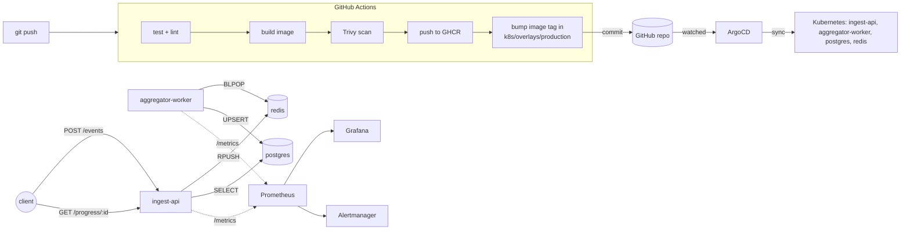

# Architecture

LearnOps is deliberately a small application wrapped in a real platform.
The app (a learning-event ingest API backed by a queue worker) exists to
give the platform something to run - the point of this repo is everything
around it.

## Components

| Layer | Tool | What it owns |
|---|---|---|
| App | Python / FastAPI, Redis, Postgres | `ingest-api` accepts learning events and enqueues them, and answers progress queries; `aggregator-worker` drains the queue and upserts running averages into Postgres. `ingest-api` exposes `/healthz`, `/readyz`, `/metrics`; `aggregator-worker` exposes `/metrics` only. |
| CI | GitHub Actions (`.github/workflows/ci-cd.yml`) | Lint (hadolint, kubeconform), test (against real Postgres/Redis service containers, not mocks), build, Trivy scan, push to GHCR, then bump the image tag in `k8s/overlays/production`. |
| IaC | Terraform (`infra/terraform/local`) | Provisions the local `kind` cluster and bootstraps cluster-wide platform tooling: ArgoCD and kube-prometheus-stack. A separate, never-applied `infra/terraform/gcp-reference` module maps the same platform onto real GCP (GKE Autopilot, Cloud SQL, Memorystore, Artifact Registry, Cloud Logging). |
| CD | ArgoCD | Watches `k8s/overlays/production` in this repo and continuously reconciles the cluster to match it (auto-sync + self-heal + prune). |
| Manifests | Kustomize (`k8s/`) | `base/` has Postgres, Redis, the two app Deployments/Services/HPA/ServiceMonitors, and the PrometheusRule; `overlays/staging` and `overlays/production` patch replica counts, Service type, and image tags per environment. |
| Observability | kube-prometheus-stack (Prometheus, Grafana, Alertmanager) | ServiceMonitors scrape `/metrics` from both services; a provisioned Grafana dashboard visualizes ingestion/processing/failure rates; a PrometheusRule alerts on service-down, high event-failure rate, and the autoscaler sitting at its ceiling. |

## Why this split

Terraform and ArgoCD have non-overlapping jobs on purpose:

- **Terraform** answers "does the cluster and its platform tooling exist?" -
  cluster lifecycle, ArgoCD, monitoring stack. Re-running `terraform apply`
  should never redeploy the app.
- **ArgoCD** answers "does the cluster match git?" for the application. CI's
  job is to produce a new image and tell git about it (by bumping the tag in
  `k8s/overlays/production/kustomization.yaml`); ArgoCD's job is to notice
  and apply it. Nobody runs `kubectl apply` by hand in normal operation.

This is the standard GitOps split: CI does continuous integration and stops
at "update the manifest," CD (ArgoCD) does continuous deployment by
watching git.

Postgres and Redis are plain Kubernetes manifests here (not
Terraform-managed Helm releases) because on `kind` they're just pods, same
as the app - Terraform owning them wouldn't buy anything locally. In the
GCP-shaped reference module, the equivalent resources (Cloud SQL,
Memorystore) genuinely are Terraform-managed, outside Kubernetes entirely,
because they're real managed services there.

## Request / data flow

## Local-demo simplifications (called out deliberately)

- No Ingress controller - `ingest-api` is exposed via NodePort for
  simplicity. A real environment would front it with an Ingress/LoadBalancer
  and TLS (or, on GCP, a Cloud Load Balancer in front of GKE).
- `aggregator-worker`'s liveness/readiness probes hit its own `/metrics`
  endpoint rather than a dedicated health check - it has no other HTTP
  surface, so this is a proxy for "the process is alive and past its
  Postgres/Redis connection at startup," not a full health check.
- `ingest-api` connects to Postgres eagerly at import time
  (`db_conn = get_connection()`), so if it starts before Postgres is ready
  it crashes and relies on Kubernetes' restart policy to retry until it
  succeeds. We saw this happen during our own local rollout - a few
  `CrashLoopBackOff` cycles before it stabilized. A more robust version
  would retry the connection with backoff, or use an init container that
  waits for Postgres - noted here as a real improvement, not implemented,
  to keep the app code focused.
- Postgres and Redis run without persistence guarantees beyond a single PVC
  (Postgres) or none at all (Redis) - fine for a demo cluster that gets torn
  down, not for production.
- The `learnops-secrets` Kubernetes Secret is committed in plaintext - a
  real deployment would use Sealed Secrets, External Secrets Operator, or a
  cloud secret manager.
- ArgoCD is reached via `kubectl port-forward` rather than an exposed
  Ingress, and runs with `server.insecure=true` (plain HTTP behind the
  port-forward) purely to avoid self-signed TLS friction in a local demo.
- `metrics-server` runs with `--kubelet-insecure-tls` because `kind` nodes
  don't have kubelet serving certs metrics-server can verify by default.
  Standard for local `kind`/`minikube` clusters; not something you'd do
  against a real cluster.
- GHCR packages are assumed public so the cluster can pull images without an
  `imagePullSecret`. A private registry would need one configured on the
  `learnops` namespace's default service account.
- Running two full `kind` clusters at once on this machine caused a genuine
  CPU-starvation cascade (control-plane scheduler/controller-manager
  crash-looping, cascading into ArgoCD and Grafana instability) during
  development - see [`docs/RUNBOOK.md`](RUNBOOK.md) for the diagnosis and
  fix, kept here because it's a realistic lesson about local resource
  limits, not a hypothetical one.